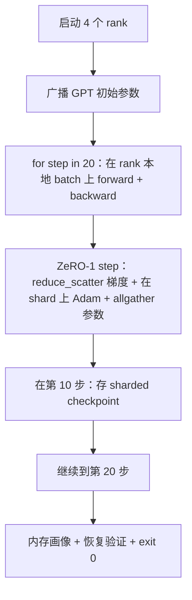

# 端到端分布式训练

> 第 76 到 80 课各自造了一个零件。这一课是组装：用 DDP 做 gradient sync、用 ZeRO-1 做 optimizer-state sharding、在中途存一个 sharded checkpoint，把一个微型 GPT 训练在 4 个模拟 rank 上。Demo 跑 20 步，自我终止，打印一条 loss 曲线加一份内存画像，并写出一个可恢复的 checkpoint。

**类型：** Build
**语言：** Python
**前置要求：** 阶段19 Track C 第42-49课
**预计时间：** ~90 分钟

## 学习目标

- 把 DDP（第77课）、ZeRO-1（第78课）、sharded checkpoint（第80课）组装进一个训练循环。
- 在一个小型合成语料上，横跨 4 个模拟 rank，把一个 2 层 transformer 语言模型训 20 步。
- 打印一张逐步 loss 表、一份逐 rank 内存画像，以及一个能在同样 world size 上逐字节恢复的 checkpoint manifest。
- 论证这套组合：每个零件在前面的课里都能独立测试，而本课证明它们组装得起来。

## 问题背景

Capstone 就是证明这些零件能拼到一起。第 76 课实现了 collective。第 77 课把它们包进 DDP。第 78 课用 reduce_scatter shard 了 optimizer state。第 79 课分析了 pipeline。第 80 课存了一个 sharded checkpoint。每一课都各自成立，带自己的测试。真实训练一次性用上每一个原语；如果组合出了错，loss 会发散、checkpoint 会拒绝恢复、或者本该缩小的逐 rank 内存反而增长。

本课跑端到端 demo，并验证四条不变量：(a) loss 在 20 步里单调下降（容忍 float 噪声），(b) 每个 rank 在每一步都持有相同的参数 norm，(c) 逐 rank 的 optimizer 内存等于 ZeRO-1 公式 12P/N 字节，(d) 第 10 步的 checkpoint 在重启时逐字节重新加载。Demo 自我终止：20 步，单条命令，exit 0。

## 核心概念



### 这个 mini GPT

模型故意做得小：2 个 transformer block，embed dim 32，4 个 attention head，vocab 64，序列长度 16，batch 4。几千个参数。大到足以演练每一个接线决策（multi-head attention 走标准的 masked 路径；LayerNorm 有权重要同步；LM head 是一个单独的线性投影回 vocab）。又小到 20 步在 4 个 CPU rank 上几秒就跑完。

### 组合规则

| 课程零件 | 它负责什么 | 它留给循环什么 |
|--------------|--------------|----------------------------|
| DDP broadcast | 初始参数同步 | 构造时调一次 |
| ZeRO-1 step | gradient sync、master copy 更新、参数广播 | 每步调一次，替换 optimizer.step |
| Sharded checkpoint | 持久化每 rank 状态、带 sha256 的 manifest | 在 rank 0 上调用，状态通过 allgather 收集 |
| 训练循环 | forward、backward、loss 记录 | 按顺序调用上面三个 |

循环不知道 reduce_scatter 或 rendezvous 文件的存在。ZeRO 和 checkpoint 模块暴露窄接口，由循环来组合。

### 为什么用微型 GPT 而不只是 MLP

第 77 课的 MLP 足以验证 gradient sync。一个微型 GPT 加了三样东西：一个独立的、覆盖 vocab 的 LM head（本课为清晰起见不绑定；完整 GPT 通常把 head 和 token embedding 绑定），softmax+cross-entropy 作为 loss（比 MSE 有更多数值边界情况），以及一个非对称的 forward（每层先 embedding 再 attention 再 MLP）。capstone 还守着 MLP 的话，就藏住了组合到底有没有正确处理 LayerNorm 或 embedding 层的梯度形状。

### 自我终止意味着 exit 0

循环跑固定的 20 步然后退出。没有 `while True`，没有人工干预，不从外部状态恢复。一个你可以放着不管、跑完回来发现一份完整日志的 capstone，才是证明系统接对了的 capstone。如果某个零件死锁，demo 就永不返回，测试装置会抓住它。

## 动手构建

`code/main.py` 实现了：

- `MiniGPT`：2 层 transformer，带 masked self-attention 和一个独立的 LM head。
- `make_corpus(seed, total_tokens)`：确定性的 next-token 预测数据。
- `_train_worker`：每个 rank 启动一份；广播初始参数、跑循环、调 ZeRO step、在第 10 步写 sharded checkpoint。
- `verify_resume`：主运行之后，进程内重新加载第 10 步的 checkpoint，断言存下来的 master shard 与内存快照逐字节相符。
- `main`：编排整个 demo，打印 loss 表、内存画像和验证结果。

运行：

```bash
python3 code/main.py
```

输出：一张 20 行的 loss 表、一份 4 行的逐 rank 内存画像、一个 checkpoint manifest，以及成功时的一行 "RESUME VERIFIED"。

## 真实世界中的生产模式

有三个模式把这套组合收尾，让它能真正跑起来。

**每 K 分钟 checkpoint 一次，而不是每 K 步。** 步时间随序列长度和 microbatch 数量变化。10 分钟的 checkpoint 节奏不论模型大小都覆盖同样的计算量。本课为简单起见用基于步的；生产用基于墙钟的。

**尽早检测发散。** 生产运行会在 backward 之后加一个 NaN 守卫和一个 loss-spike 检测器；如果一步里 loss 跳了超过 2 倍，就回滚到上一个 checkpoint，而不是放任 optimizer 走进退化状态。本课的 loss 曲线平滑，所以守卫用不上，但钩子留着。

**跨 rank 聚合内存画像。** 真实运行里逐 rank 内存因 rank 而异（持有最大 pipeline stage 的 rank 持有更多激活值）。生产记录跨 rank 的最大值加均值；本课打印逐 rank，是为了展示公式相符。

## 实际使用

生产模式：

- **DeepSpeed。** 在一份配置下组合 DDP + ZeRO + pipeline + activation checkpointing。本课的组合就是 DeepSpeed 形态的微缩版。
- **PyTorch FSDP。** 原生等价物。`FullyShardedDataParallel` 配 `ShardingStrategy.SHARD_GRAD_OP` 就是 ZeRO-2。
- **NeMo 和 Megatron-LM。** 给最大那批模型再加 tensor parallel；除此之外组合是同样的形态。

## 拿去用

整条线到此结束。这 6 节课加起来，就是一个真实团队在采用 DeepSpeed 之前会自建的分布式训练子系统；这套抽象已经对着 gloo 验证过，各种故障模式也都演练过。阶段17（基础设施与生产）是把它搬上真实集群的地方。

## 练习

1. 给 attention head 加一个 tensor-parallel 切分，验证 loss 与单 rank 基线一致。两个 rank：每 rank 一半的 head，对 attention 输出做 allreduce。
2. 加上跨 4 个 microbatch 的梯度累积，证明梯度等于一个大 batch 的梯度。
3. 加一条从第 10 步恢复的路径，让它真的继续训练到第 20 步，并产出和原始运行相同的最终 loss。
4. 加一个指标导出（loss、grad norm、步时间）到 JSONL，好让运行事后能被可视化。
5. 加一个 NaN 守卫，在 loss 突刺时回滚到上一个 checkpoint，并用一步的 LR 乘子强行制造突刺来演练回滚。

## 关键术语

| 术语 | 大家怎么说 | 实际含义 |
|------|----------------|------------------------|
| End-to-end | "全部接起来" | 一次运行组合每个零件，而不是每个零件一个单元测试 |
| Memory profile | "每 rank 多少 GB" | 每个 rank 上为参数、梯度、optimizer state 持有的字节数 |
| Resume contract | "存了再加载" | checkpoint 往返后每 rank 状态逐字节相等 |
| Self-terminating | "有界运行" | 固定步数，完成时 exit 0，没有人介入循环 |

## 延伸阅读

- [DeepSpeed 端到端训练教程](https://www.deepspeed.ai/getting-started/)
- [PyTorch FSDP 进阶教程](https://pytorch.org/tutorials/intermediate/FSDP_advanced_tutorial.html)
- [Megatron-LM 训练脚本参考](https://github.com/NVIDIA/Megatron-LM)
- 阶段19 第76-80课 - 本课所组合的每个零件
- 阶段17 - 把这套组合搬上真实集群
