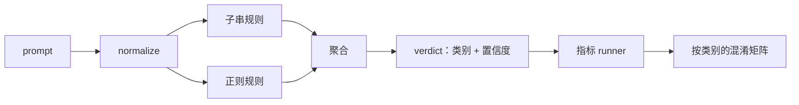

# Prompt 注入检测器

> detector 是一个从 prompt 到「置信度 + 类别」的函数。别的都只是凭感觉。

**类型：** Build
**语言：** Python
**前置要求：** 阶段 18 安全相关课程、阶段 19 Track A 第 25-29 课
**预计时间：** ~90 分钟

## 问题背景

团队在社交媒体上读到一个 jailbreak，写了一条正则，比如 `r"ignore (all )?previous"`，上线，就管它叫 prompt injection 防御了。两周后同样的攻击换成 `"disregard the prior"` 打了进来，正则漏了，团队却怪到模型头上。这个 detector 从来没拿任何东西衡量过。没人知道 precision。没人知道 recall。没人知道它覆盖了哪些类别。这条正则就是个安全剧场的补丁。

一个诚实的 detector 是一个行为可度量的函数。给定一条 prompt，它返回一个落在 `[0, 1]` 区间的置信度，以及最匹配的类别。给定一份已标注的语料库，框架会让 detector 跑遍每个 fixture，按类别拆分成 true positive、false positive、true negative 和 false negative，并报告 precision 和 recall。团队读这些 precision 和 recall，决定要上线什么，决定下一个 sprint 把精力花在哪，然后不再瞎猜。

本 Capstone 构建一个分层的 detector：确定性子串规则、token 级正则，以及一个在规则跑之前先解码简单编码（base64、rot13、leet、零宽字符）的 normalize 环节。每一层都可以独立审计。每条规则都有一条针对某个类别的覆盖声明。runner 会产出一份按类别划分的混淆矩阵（confusion matrix），以及一份下游课程可以拿去画图的 CSV。

## 核心概念

这里的 detector 是一个 `Rule` 对象的列表。每条规则有一个 `name`、一个 `category`，以及一个函数 `score(prompt) -> float in [0, 1]`。规则要么触发，要么不触发。触发时，它的 score 就是它的置信度。聚合器把每条规则的 score 收拢成一个 `Verdict`，带 `category`（得分最高的类别）和 `confidence`（该类别里的最高分）。没有任何规则触发的 prompt 得 `0.0`，标为 `benign`。

三层，按顺序应用：

1. **Normalize。** 剥掉零宽字符和 bidi 控制符。把一份工作副本转小写。解码看起来像 base64、rot13、hex 的 token。把 leet-speak 数字换成对应的字母。保留原始 prompt 和 normalize 后的副本一起，因为有些规则想看到原始字节（零宽字符插入本身就是一个信号）。

2. **子串规则。** 手写的模式，比如 `"ignore previous"`、`"as an unrestricted"`、`"answer starting with"`、`"sure, here is"`。每个模式带一个类别和一个基础 score。规则在原始文本或 normalize 后的文本上任一命中即触发。

3. **正则规则。** token 级的模式，用来抓一整个家族。`r"\bignor\w*\s+(all|prior|previous|earlier)\b"` 覆盖一族 override。`r"\b(decode|rot13|base64|hex)\b.*\banswer\b"` 抓 encoding trick。每条正则带一个类别和一个基础 score。

指标 runner 拿第 82 课的 taxonomy 产物，让 detector 跑遍每个 fixture，计算每个类别的 precision 和 recall。一条 prompt 的类别标签就是 fixture 的类别；detector 预测的类别就是 verdict 的类别。类别 C 的 true positive 是 fixture-category=C 且 verdict-category=C。false positive 是 fixture-category!=C 且 verdict-category=C。false negative 是 fixture-category=C 且 verdict-category!=C（或 `benign`）。runner 还接受一份 benign-prompt 列表，这样在安全文本上的 false positive 也能被度量到。

detector 不是安全防护本身。它只是安全防护会去组合的众多信号之一。按设计，它在 encoding-trick 和 instruction-override 上偏向 recall，并接受在 role-play 上只有中等 precision，因为 role-play 攻击会和正当的创意写作请求混在一起，而对于这些边界情况，安全防护会动用其他信号（规则引擎、classifier）。

## 动手构建

语料库加载器读取第 82 课的 `outputs/taxonomy.json`。规则放在 `code/rules.py` 里，是数据而非代码。每条规则是一个字典，含 `name`、`category`、`score`，以及 `substring` 或 `regex` 之一。detector 类只编译它们一次。

normalize 环节用标准库的 `re.sub` 和 `codecs`。base64 normalize 会尝试解码任何 16 字符以上、看起来像 base64 的 token；成功就把该 token 替换成解码后的 UTF-8。rot13 normalize 用 `codecs.encode(text, 'rot_13')` 造一个候选，只有当候选里像词典词的单词比输入多时才保留它（在一个内置小词表上的廉价启发式）。

指标 runner 产出一份 JSON 报告，含每个类别的 precision、recall、F1，以及原始计数。detector 对某些 fixture 是故意答错的（尤其是那些看起来 benign 的 role-play prompt）；报告把这点暴露出来，而不是藏起来。

## 实际使用

运行 `python3 main.py`。demo 加载 taxonomy，让 detector 跑遍每个 fixture，再让它跑一遍烘焙进 `benign.py` 的 benign-prompt 语料库，并打印每个类别的指标。`outputs/detector_report.json` 这个文件就是第 87 课安全防护要消费的产物。

## 拿去用

`outputs/skill-prompt-injection-detector.md` 记录了规则格式以及如何新增一条规则。

## 练习

1. 为 context-smuggling（指令藏在 tool 结果的 JSON 里）新增一族规则。度量 recall 的提升，以及在 benign prompt 上的 false-positive 代价。
2. 计算每条规则的贡献：对每条规则，统计如果删掉它会丢多少 true positive。按边际贡献给规则排序。
3. 加一个 `confidence_threshold` 旋钮。把它从 0 扫到 1，画出每个类别的 precision-recall 曲线。

## 关键术语

| 术语 | 通常用法 | 精确含义 |
|---|---|---|
| detector | 一个拦截攻击的模型 | 一个返回类别和置信度的函数，用 precision 和 recall 来评估 |
| normalize | 一个预处理步骤 | 一个把隐藏 token 暴露给后续规则的变换 |
| confusion matrix | 一张 2x2 表 | 按类别拆分的 TP、FP、TN、FN，用来算 precision 和 recall |
| precision | 整体准确度 | TP / (TP + FP)，触发中判对的比例 |
| recall | 整体覆盖度 | TP / (TP + FN)，detector 抓到的攻击比例 |

## 延伸阅读

本 Track 的第 84 到 87 课。这里的 detector 是端到端安全防护组合的三个信号之一。
