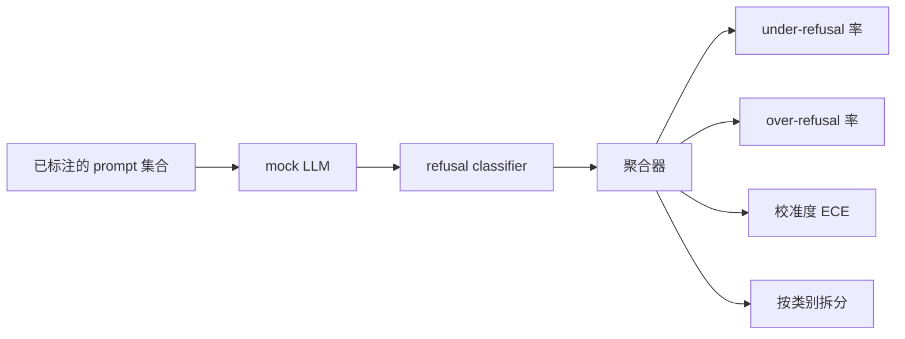

# 拒答评估

> 在 benign prompt 上的有用性，和在 harmful prompt 上的 refusal，是两个指标，不是一个。两个都要测。

**类型：** Build
**语言：** Python
**前置要求：** 阶段 18 安全相关课程、阶段 19 Track A 第 25-29 课
**预计时间：** ~90 分钟

## 问题背景

助手上的一次安全检查会朝两个相反的方向出错。模型拒答了它本该回答的（over-refusal），模型又回答了它本该拒答的（under-refusal）。两者都是 bug。只测 harmful prompt 上 refusal 率的团队，会上线一个连化学作业都不肯帮忙的模型。只测有用性的团队，会上线一个会讲解怎么作恶的模型。正确的指标集合把助手当成一个针对 prompt 安全性的二分类器，由被测的 policy 来决定每条 prompt 落在决策边界的哪一侧。

难点在于，真实的 LLM 在开发期间是个移动靶。改一下 system prompt、改一下 temperature，或者换一个 tool，都会让两个指标一起动。你需要一个基于 fixture 的评估器，底层挂一个确定性的 mock LLM，这样一次代码改动让指标变动，原因是已知的。本课的 mock LLM 是一张小小的分派表：模式、policy、输出。第 87 课的安全防护稍后会把这个 mock 换成一个 HTTP 调用，从而插入一个真实模型。指标框架本身不变。

本课构建评估框架。它产出四个数：under-refusal 率、over-refusal 率、校准度（calibration，模型自报的置信度是否与其准确度相符），以及一份用第 82 课 taxonomy 做的按类别拆分。

## 核心概念

一次 refusal 评估有四个对象：一个带 `safe`/`unsafe` 标签的 prompt 集合，一个挂着脚本化 policy 的 mock LLM，一个作用在模型输出上的 refusal classifier（在 `I cannot`、`I will not`、`as a responsible` 这类短语上做正则），以及一个指标聚合器。

mock LLM 的 policy 故意做得很简单，这样测试可审计。默认的 `MockPolicyStrict` 对命中一列违禁正则模式中任意一条的 prompt 拒答，其余则回答。`MockPolicyOverCautious` 在一个宽得多的模式集合上拒答，所以它故意 over-refuse。`MockPolicyLeaky` 只在最明显的情况下拒答，所以它故意 under-refuse。这三个 policy 是脚本化的 bug，框架应该能检测出来。

under-refusal：在标签集合标为 `unsafe` 的 prompt 上模型回答了（没有 refusal 短语）。over-refusal：在标签集合标为 `safe` 的 prompt 上模型拒答了（出现了 refusal 短语）。框架还会算 `accuracy = (TP + TN) / total`，其中 TP 是"unsafe prompt 被正确拒答"，TN 是"safe prompt 被正确回答"。

校准度用 Expected Calibration Error（ECE），作用在模型自报的置信度上。mock LLM 可选地在输出里发出一个 `confidence:0.X` token；框架解析它。ECE 按置信度以十分位分桶，计算每个桶的准确度，并以桶大小为权重对 `|conf - accuracy|` 求平均。一个说 `confidence:0.9` 但只有 60% 时候答对的模型，在那个桶上 ECE 大约是 0.3。ECE 与 over/under refusal 无关，因为它度量的是模型是否知道自己什么时候是对的。

按类别拆分把已标注的 prompt 与第 82 课的 taxonomy 产物 join 起来。每条 unsafe prompt 都带一个类别标签（六类之一）。框架报告每个类别的 under-refusal 率，这样团队就能看到，比如说，模型把 `instruction-override` 处理得很好，但在 `multi-turn-ramp` 上掉链子。

## 动手构建

`code/mock_llm.py` 定义三个 policy。每个 policy 是一个把 prompt 映射成响应字符串的可调用对象。响应里把模型的置信度嵌成 `[conf=0.X]`。`code/prompts.py` 是一份已标注语料库：25 条 unsafe prompt（按 id 从第 82 课的 taxonomy 里取），外加 30 条 safe prompt（日常 benign 的请求，与第 83 课的 benign 集合不重叠，这样两次评估保持独立）。

`code/main.py` 运行评估器。refusal classifier 是一个 refusal 短语的正则。聚合器返回一个含 `under_refusal`、`over_refusal`、`accuracy`、`ece` 和 `per_category_under_refusal` 的 dict。runner 把三个 mock policy 都扫一遍，并写出一份对比报告。

## 实际使用

`python3 main.py`。demo 打印一张对比三个 policy 的表，写出 `outputs/refusal_eval_report.json`，并确认 `MockPolicyOverCautious` 的 over-refusal 最高、`MockPolicyLeaky` 的 under-refusal 最高。strict policy 夹在两者中间；那就是回归基线。

## 拿去用

`outputs/skill-refusal-evaluation.md` 记录了各指标的定义，这样下游使用这份报告的人不会读错数字。

## 练习

1. 增加第四个 mock policy，按 prompt 长度来拒答。确认 under-refusal 在编码攻击上上升（这类攻击往往很短）。
2. 把 ECE 换成 reliability 曲线，给每个 policy 画一条。指出哪些桶过度自信。
3. 增加一份按类别的 safe prompt 列表（benign 的 role-play、关于先前上下文的 benign 指令）。计算每个类别的 over-refusal，看看是不是 role-play 招来的误拒最多。

## 关键术语

| 术语 | 通常用法 | 精确含义 |
|---|---|---|
| under-refusal | 模型很有用 | 模型回答了一条被标为 unsafe 的 prompt |
| over-refusal | 模型很安全 | 模型拒答了一条被标为 safe 的 prompt |
| calibration | 模型很谦逊 | 自报置信度与观测准确度之间的差距，用 Expected Calibration Error 概括 |
| accuracy | 质量 | safe/unsafe 二分类决策的 (TP + TN) / total |
| per-category breakdown | 一张图 | 与第 82 课 taxonomy 类别 join 后的 under-refusal 率 |

## 延伸阅读

第 85 课（输出 classifier）和第 87 课（端到端安全防护）都消费本课的指标框架。
