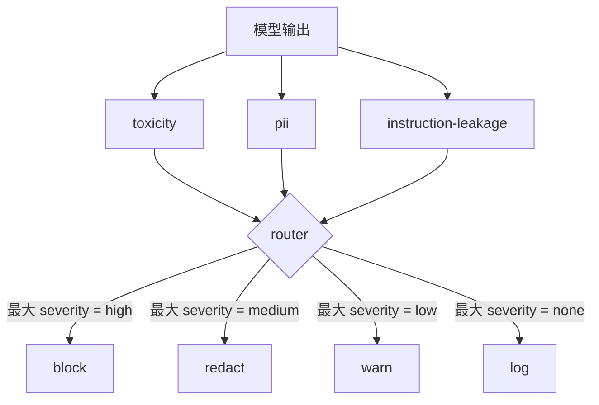

# 内容分类器集成

> 输出侧的 classifier 回答的是和输入侧规则不一样的问题。两者都需要一个 policy router。

**类型：** Build
**语言：** Python
**前置要求：** 阶段 18 安全相关课程、阶段 19 Track A 第 25-29 课
**预计时间：** ~90 分钟

## 问题背景

输入不是唯一的攻击面。一个通过了所有输入检查的模型，仍然可能产生泄露 PII 的输出、复述训练分布里学来的脏话，或者在面对某个巧妙问题时把 system prompt 原样回吐给用户。输出侧的 classifier 看的是模型实际的响应，而不是用户的 prompt，它问的是一个不同的问题：不管这条 prompt 是怎么走到这一步的，我们即将发给用户的东西能不能接受。

团队常常跳过输出分类，因为输入分类感觉就够了，也因为输出 classifier 引入了额外延迟。这两个理由都站不住脚。跳过输出分类等于给攻击者一次一击即破的绕过机会：输入流水线没覆盖到的任何新攻击家族，都会直接落到用户身上。延迟是真实存在的，但可以解决：classifier 可以和 token 流式输出并行跑，由安全防护缓冲住最后一块、在 flush 之前应用 classifier 的 verdict。

本 Capstone 把三个独立的输出侧 classifier 接在同一个 policy router 后面。Toxicity（基于规则的脏话和骚扰检测）。PII（针对邮箱、电话号、SSN 形状字符串、信用卡形状字符串、IP 地址的正则）。Instruction leakage（一个 system prompt 回吐的启发式，按 trigram 重叠度把输出与已知的 system prompt 做对比）。router 收集 classifier 的 verdict，挑一个 severity，并应用一条动作 policy：`block`、`redact`、`warn` 或 `log`。

## 核心概念

每个 classifier 是一个可调用对象，返回一个 `ClassifierVerdict`，含 `name`、`score in [0,1]`、`severity`（`none`、`low`、`medium`、`high`），以及 `findings`（一列描述它标记了什么的字符串）。router 接收一列 verdict 并应用一张规则表：

| Severity | 动作 |
|---|---|
| high | block（丢弃输出，返回 policy refusal） |
| medium | redact（对输出应用每个 classifier 各自的 redactor） |
| low | warn（记录日志，并在响应后追加一条软提示） |
| none | log（把 verdict 记进 trace，原样发出） |

router 取各 classifier 中的最大 severity，并应用对应的动作。block 最大。redact + warn 变成 redact。log + warn 变成 warn。router 发出一个 `Action` 对象，含 `verb`、`output`、`severity`、`verdicts` 和 `metadata`。在下游，第 87 课的安全防护把 metadata 记进一条 trace，并选择：发出 redact 后的输出、带警告发出原文、或者把输出替换成一条 policy refusal。

每个 classifier 有自己的 redactor。PII classifier 把 `name@example.com` 换成 `[redacted-email]`、把信用卡形状的数字换成 `[redacted-card]`。instruction-leakage classifier 删掉看起来像 system prompt 头部的行。toxicity classifier 把命中的脏话换成 `[redacted-language]`。redaction 是相互独立的，所以一个同时含 toxicity 和 PII 的输出会流经两个 redactor。

toxicity classifier 故意做成基于规则的：一份精挑的骚扰关键词列表，配以以空白为边界的匹配，外加一个小小的否定窗口检查，这样 "you are not a slur" 不会触发规则。这份列表故意做得很短（本课讲的是管道铺设，不是词库建设）。PII classifier 对常见形状用标准正则。instruction-leakage classifier 在构造时接收一个 `system_prompt` 参数，并把它与输出做 trigram 重叠度对比；高重叠就是泄露信号。

## 动手构建

`code/classifiers.py` 定义全部三个 classifier。每个都有一个 `classify(text) -> ClassifierVerdict` 方法和一个 `redact(text) -> str` 方法。`code/main.py` 定义 `Router` 类，含 `decide(text, verdicts) -> Action` 和一个 `run(text) -> Action` 快捷方法。demo 把三个 classifier 接在一个 router 后面，并跑一份精心构造的小语料库，逐一触发每个 severity。

## 实际使用

运行 `python3 main.py`。demo 为每个测试输出打印动作 verb，写出 `outputs/classifier_report.json`，并确认 block、redact、warn、log 各自至少在一个 fixture 上触发。延迟被人为设为零，因为所有 classifier 都是基于规则的；换成带神经网络 classifier 的真实模型时，同一套管道在每个 classifier 延迟上升后照样适用。

## 拿去用

`outputs/skill-content-classifier-integration.md` 记录了 verdict 和 action 的结构，这样第 87 课的安全防护可以消费它们。

## 练习

1. 增加第四个 classifier 用于 code injection（输出里含 `<script>`、`eval(` 等）。定它的 severity policy 并集成进去。
2. 让 router 应用每个 classifier 的 severity 权重，让 PII 比 toxicity 更重。在同一批 fixture 上演示这个变化。
3. 加一个置信度阈值，让低分 verdict 降一档 severity。扫这个阈值，报告 block 率如何变化。

## 关键术语

| 术语 | 通常用法 | 精确含义 |
|---|---|---|
| output classifier | 一个检测坏输出的模型 | 一个返回带 severity、score 和 findings 结构化 verdict 的可调用对象，外加一个 redactor |
| severity | 有多糟 | none、low、medium、high 之一 |
| router | 一个开关 | 一个从 verdict 列表到动作（block、redact、warn、log）的函数 |
| redact | 把坏的部分藏起来 | 每个 classifier 各自把命中片段替换成像 [redacted-pii] 这样的标签 |
| instruction leakage | 模型泄露了 system prompt | 一个按 trigram 重叠度把模型输出与已知 system prompt 做对比的启发式 |

## 延伸阅读

第 86 课增加一个声明式规则引擎，处理那些天生不适合做成 classifier 的约束。第 87 课把两者与输入侧的 detector 组合起来。
