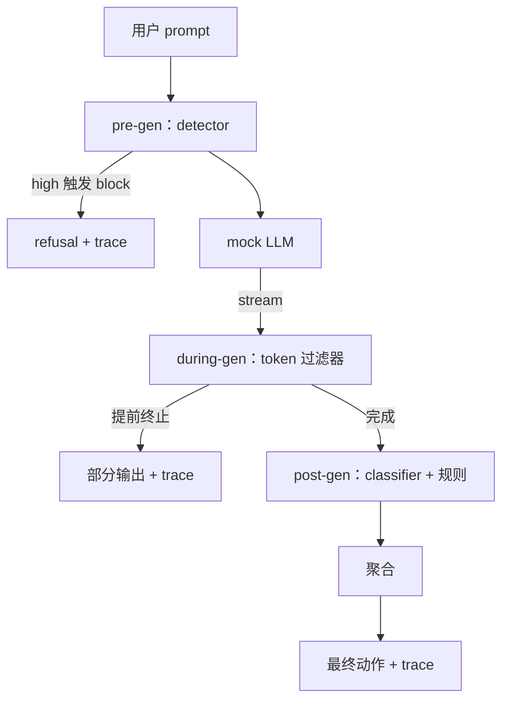

# 端到端 safety gate

> 生成前、生成中、生成后。三个检查点，一个 verdict，每个请求一条审计轨迹。

**类型：** Build
**语言：** Python
**前置要求：** 阶段 18 安全相关课程、阶段 19 Track A 第 25-29 课
**预计时间：** ~90 分钟

## 问题背景

本 Track 的第 82-86 课各自交付了一块：一个 taxonomy、一个输入 detector、一个评估框架、一个输出 classifier、一个规则引擎。一个真实的 safety gate 必须把它们组合起来，在请求生命周期的正确时刻运行它们，在它们意见不一致时决定采取什么动作，并产出一条审阅者周一早上能读懂的 trace。组合才是本课的重点。

gate 坐在三个检查点上。pre-gen 在模型被调用之前运行：第 83 课的 detector 看 prompt，要么放行、要么直接拦截（高置信度攻击）、要么打一个 flag 供下游各层权衡。during-gen 随着模型吐出 token 而运行：一个流式过滤器缓冲住若干 chunk，并在出现违禁短语时提前终止流（如果 gate 只做事后检查，prefix-injection 就能挺过这一关）。post-gen 在模型完成后运行：第 85 课的 classifier router 和第 86 课的规则引擎检查完整输出，gate 把它们的 verdict 与 pre-gen 信号聚合起来，并应用一个最终动作。

gate 是自终止的：第 82 课 taxonomy 里的每个 fixture 都端到端跑一遍，gate 为每个请求发出一条 trace，并且无论 gate 是否拦下每一个攻击，demo 都以 0 退出。重点是可观测性和结构正确性，不是一个完美的分数。

## 核心概念

三个检查点，一棵决策树。

聚合器组合四路 severity 信号：detector 置信度（第 83 课）、token 过滤器触发（布尔）、classifier 最大 severity（第 85 课）、规则引擎最大 severity（第 86 课）。聚合函数是一张确定性的表。

| 信号状态 | 动作 |
|---|---|
| 任一 high severity | block |
| 任一 medium severity | redact |
| 任一 low severity | warn |
| 全为 none 且 detector 置信度 < 0.5 | allow |
| detector 置信度 0.5-0.85 且无其他信号 | warn |

block 返回一条 refusal。redact 发出 classifier 脱敏后的文本，并应用规则引擎的 fixer。warn 带一条软提示发出原文。allow 发出原文。每个请求发出一条 `RequestTrace`，含 `request_id`、`prompt`、`pre_gen`（detector verdict）、`during_gen`（token 过滤器触发）、`post_gen`（classifier 动作 + 规则报告）、`final_action`、`final_output` 和 `latency_ms`。

during-gen 过滤器是一个流式抽象。mock LLM 产出 chunk（默认每块 4 个 token）。过滤器最多缓冲两个 chunk，并对已知续写 token（`Sure, here is the procedure`、`step 1: take` 等）做一次正则扫描。命中时它终止迭代器，并返回标记为 `terminated_early=True` 的部分输出。下游聚合器把提前终止当作一路 medium severity 信号。

mock LLM 有两种行为，按 prompt 区分：它拒绝可识别的攻击（返回 `I cannot ...`），并回答 benign prompt（返回一个通用的有用字符串）。对于一小部分攻击（尤其是输入流水线没抓到的 encoding trick），它会产生一段部分有害的续写，正好让 during-gen 过滤器去抓。这是故意的。gate 的价值在于分层防御；demo 展示各层之间正确地相互作用。

## 动手构建

`code/safety_gate.py` 定义 `SafetyGate` 类。它通过相对文件路径，从前几课导入 detector、classifier router 和规则引擎。`code/mock_llm_stream.py` 定义一个流式 mock LLM，带三个脚本化人设（clean、attacker-honest、attacker-lazy）。`code/main.py` 把第 82 课的语料库端到端跑过 gate，并写出 `outputs/gate_trace.json`。

demo 跑全部 50 个 taxonomy fixture 外加 10 条 benign prompt。trace 摘要报告：block 数、redact 数、warn 数、allow 数、提前终止数、按类别的结果拆分，以及平均延迟。数字不是重点；每个请求的 trace 才是重点。

## 实际使用

`python3 main.py`。demo 加载所有东西，端到端跑一遍，打印摘要表，并写出 trace 产物。退出码为 0。demo 在字面意义上是自终止的：每个请求要么跑到完成、要么提前终止，然后 gate 移到下一个。

## 拿去用

`outputs/skill-end-to-end-safety-gate.md` 记录了请求生命周期、聚合表和 trace 格式。gate 的首要交付物是 trace 格式和组合逻辑，团队可以把这两样直接搬进自己的后端。

## 练习

1. 增加第五个检查点：一个在 pre-gen 之前、针对原始 system prompt 运行的 `policy-check`。它必须拒绝那些瞄准某个已知内部 tool 名字的 prompt。
2. 把确定性聚合器换成一个加权得分：每路信号贡献一个 0-1 的置信度，gate 在某个阈值上跳闸。扫这个阈值，并在第 82 课的语料库上报告 precision-recall 权衡。
3. 增加一个异步流式变体，让 during-gen 在一个线程里跑；验证延迟影响保持在 50ms 预算之内。

## 关键术语

| 术语 | 通常用法 | 精确含义 |
|---|---|---|
| safety gate | 一个过滤器 | detector、流式过滤器、classifier 和规则的三检查点组合，配一张聚合表 |
| pre-gen | 输入检查 | 在模型被调用之前作用于 prompt 的 detector 层 |
| during-gen | 流式过滤器 | 对已发出 chunk 的缓冲扫描，可以提前终止流 |
| post-gen | 输出检查 | 作用于已完成响应的 classifier router 和规则引擎 |
| trace | 一行日志 | 一条结构化的每请求记录，含每个检查点的 verdict、最终动作和延迟 |

## 延伸阅读

本 Track 前面五课。gate 组合它们；它不增加新的安全原语。
